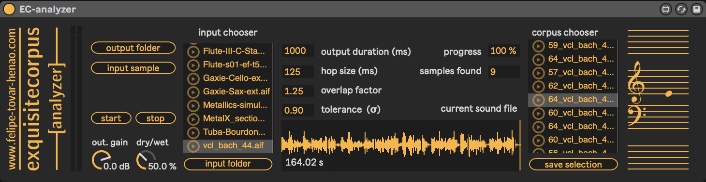
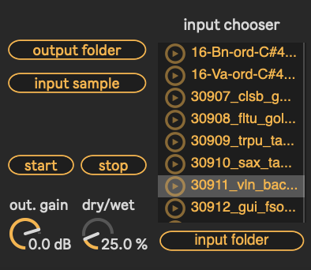
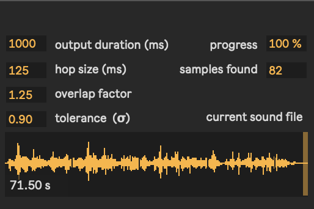
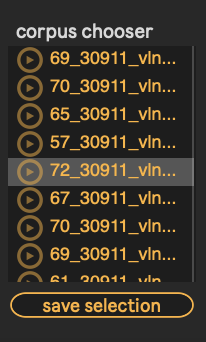
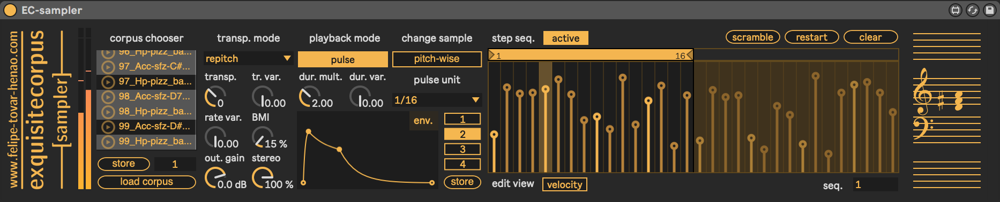
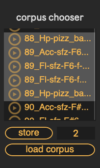
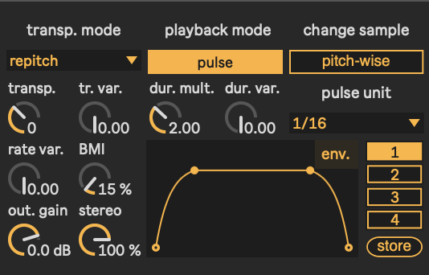
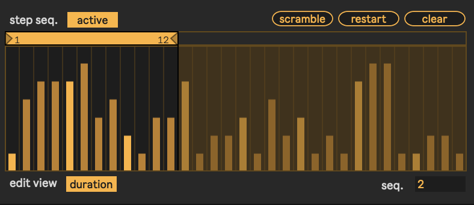

# **exquisitecorpus**: 
#### *corpus-based sampling & analysis M4L devices*

## EC-analyzer reference
**Device type**: Max instrument  
**Built on**: 
  * Ableton Live 10.1.30
  * Max 8.1.8
  * macOS Mojave 10.14.5

#### Description

Offline pitch detection and segmentation device for easy corpus construction. **EC-analyzer** works in the following way:
*	The device performs a non-real time pitch analysis on a sound file.
*	For every detected pitch, a segment of the sound file is created.
*	Each segment’s name will start with the detected pitch, in MIDI format — e.g. `60_filename-n142.wav`. The window index from the analysis — e.g. `-n142` — is also added at the end to differentiate between multiple segments sharing the same detected pitch. 
*	Once the analysis is completed, each of the segments can be previewed by the user, using the corpus chooser. The preview consists of a comparison between the sample segment and a synth playing the detected pitch. This helps to quickly identify which segments were assigned the correct pitch.
*	Finally, the user can select any of the resulting segments and save them in a target folder.

For corpus-based sampling, see **EC-sampler**.

#### Parameters and user interface:

  

* **output folder**: opens dialog window to select a directory in which the resulting segments will be saved.
* **input sample**: opens dialog window to select the sample to be analyzed and segmented.
* **input folder**: opens dialog window to select a folder from which to choose the sample to be analyzed and segmented. This makes the process easier when wanting to analyze several different samples.
* **input chooser**: when loading using *input folder*, all the samples in the folder are displayed in this window. Click sample on which to perform the analysis.
* **start**: starts pitch detection and segmentation.
* **stop**: stops pitch detection and segmentation.

  

* **output duration (ms)**: sets the duration for all the resulting segments. Please note, this duration does not determine the window size of the analysis.
* **hop size (ms)**: sets the time interval between adjacent windows for the analysis.
* **overlap factor (ms)**: determines the amount of overlap between adjacent windows for the analysis. `total_window_length = hop_size * overlap_factor`.
* **tolerance (σ)**: sets the error tolerance for pitch detection, in semitones. More precisely, it is the maximum standard deviation allowed for a pitch to be detected.
* **progress**: shows the percentage of the analysis — this can also be viewed in the waveform display.
* **samples**: shows the number of segments created at the end of each analysis.

  

* **corpus chooser**: displays every detected segment for preview.
* **save selection**: writes all the selected segments into the output folder.
* **out. gain**: sets output gain in dB.
* **dry/wet**: controls the mix between the preview segments and the synthesizer.

#### Recommendations:
*	**EC-analyzer** performs significantly better on monophonic and clearly pitched sound files. Using noisy or spectrally dense samples will result in faulty pitch detection or reduced number of output segments.
* Similarly, **EC-analyzer** tends to do better at detecting middle-range pitches (55-70), so low-pitched samples are more likely to be missed or mislabeled during the analysis.
*	When the number of resulting segments is lower than expected, try using a shorter hop size or decreasing the overlap factor— this will contribute to detecting pitches with shorter durations.
*	Although using a low tolerance will guarantee that the segments will be clearly pitched, this may result in very few, or no segments to choose from.
*	During the segment selection process, work your way from the top to the bottom of the list. When selecting multiple segments, chooser will only play the lowest selected segment.

## EC-sampler reference
**Device type**: Max instrument

#### Description

Corpus-based sampling device that allows for absolute pitch transposition over a selection of multiple audio files — i.e a *corpus*. For **EC-sampler** to work properly, please note that:
* The corpus must be a single folder, containing multiple and relatively short (1-5 sec) audio files. Longer files are ok but, in most situations, you won’t be using their full length.  
* Each sound in the corpus should have a clear, predominant pitch. This doesn’t mean that the sample must consist of a single note, but rather that a single pitch should dominate over the others — either by duration, loudness, repetition, or proximity to the beginning of the file.
* The filenames of the samples must start with the MIDI pitch value that best describes its content — e.g. `60_guitar_pluck.wav`. **EC-sampler** uses this information to provide absolute pitch control.
* Only `.wav` or `.aif` files are supported.

For quick corpus construction, see **EC-analyzer**.

#### Parameters and user interface:

  

* **load corpus**: opens dialog window to select a directory containing multiple `.wav` or `.aif` audio files. As mentioned earlier, the name of each sound file should include at the beginning its corresponding MIDI pitch value — e.g. `71_clarinet_sound.aiff`
* **corpus chooser**: Displays all the audio files in the loaded corpus. At least one sample must be selected in order for **EC-sampler** to work.
* **store selection**: **EC-sampler** has 10 slots to store selections of samples within the same corpus. To do this, select the target slot using the number box, then select the selection of samples you want to store, and click on the store button. Changing the slot index will automatically load the selection assigned to that slot.

  

* **transp. Mode**: sets the mode of transposition. 
  * **bypass**: Removes any pitch transposition, preserving every sample's original pitch and duration.
  * **resample**: transposition affects both the pitch and original duration of the sample.
  * **repitch (default)**: transposition only changes the pitch while preserving the original duration of the sample.
  * **stretch & repitch**: similar to *repitch*, but the entire sample is stretch to fit the duration of the note — in other words, duration a pitch are modified independently. Note that both *repitch* and *stretch & repitch* are more CPU intensive than *resample* and, of course, *bypass*.
* **playback mode**: Sets the behavior between MIDI input and sample playback.
  * **trigger (default)**: a sample is triggered only when there is a new incoming MIDI note.
  * **pulse**: A stream of samples are triggered according to the specified pulse unit (see pulse unit). This mode only works when the Live transport is running. 
* **change sample**: sets the rate at which a new sample is assigned.
  * **pitch-wise (default)**: for every active MIDI pitch, a different sample from the corpus selection will be assigned.
  * **chord-wise**: When multiple MIDI pitches are active at the same time, the same sample from the corpus selection will be assigned to all of them. This only works in pulse mode. See playback mode. 
* **pulse unit**: sets the rhythmic value with respect to the current tempo, as a rational number. The fraction is expressed in relation to the whole-note within the current tempo — e.g. 1/16 = 16th note, 1/12 = 8th note triplet, 3/8 = dotted quarter note, and so on.
* **transposition**: controls the global transposition of the sampler in cents.
* **tr. var**: sets the amount of random variation in transposition.
* **dur. mult**: sets the duration ratio with respect to the pulse unit. 
* **dur. var**: sets the amount of random variation in note duration.
* **rate. var**: sets the amount of random variation in pulse rate. This only works in pulse mode. See playback mode. 
* **BMI (or body mass index)**: specifies how extreme the transposition of each sample can be. A greater BMI will allow more samples per pitch to be used, resulting in a more varied but less naturally-sounding corpus. Conversely, a lower BMI will result in a less varied but more naturally sounding corpus.
* **out. gain**: sets output gain in dB.
* **stereo**: controls the width of the stereo image. 
* **envelope**: GUI for envelope specification. 
  * [click] on background to add a new point.
  * [click] on point to change its position. 
  * [alt+click & drag] to edit curvature between points.
  * [shift+click] to delete point.
* **store envelope**: **EC-sampler** has 4 slots to store different envelopes. To do this, select the target slot by clicking the slot tab, then modify the envelope as desired, and click on the store button. Changing the slot index will automatically load the envelope assigned to that slot.

  

* **step sequencer**: GUI for customizing a duration-velocity step sequence to be used in pulse mode. The period and segment of the step sequence can be changed via the loop selector on top.
* **sequence index**: The step sequencer contains 8 different slots in which to store separate sequences. The sequence index sets the sequence to be used or edited. 
* **step sequencer toggle**: Enables/disables the use of the step sequencer in pulse mode.
* **edit view**: Sets the step sequencer layer to be edited — i.e. velocity or duration.
* **scramble**: shuffles the order of all the current step values within the same edit view.
* **restart**: Sets back the sequence to step 1.
* **clear**: Normalizes all the step values in the current edit view.

#### Recommendations:
*	When a corpus is loaded, **EC-sampler** automatically computes a dictionary specifying which samples are closer to each MIDI pitch, in order to minimize extreme transpositions. The percentage of the closest samples to be used for each pitch is determined by the BMI parameter. For reference, a BMI of 100% will use all the selected samples, resulting in possibly extreme pitch transpositions. A BMI of 0% will only use the sample that requires the smallest transposition amount for each pitch.  
*	For a more naturally sounding corpus, make sure the samples in your corpus are as evenly distributed as possible in terms of pitch. For example, if the original MIDI pitch range of all the samples is, let’s say, between a 60 and 64, this will result is extreme transpositions when trying to get pitches outside of that range.
* Using the bypass tranposition mode might seem unintuitive at first because it gets rid of the main premise of the device — i.e. providing absolute pitch control across the corpus's samples. However, using this mode has its own appeal when used with a low BMI value, because it would use the MIDI input to determine the *register* (as opposed to the *pitch*) of the chosen samples.
*	To store a corpus selection, first make sure you have set the slot number in which you want to store them prior to selecting the samples in the chooser. Otherwise, the selected samples will be replaced by the samples previously stored in the slot. 
*	Bear in mind that, when loading a corpus selection, this won’t be reflected in in the chooser. That is, the samples won’t appear as selected.
